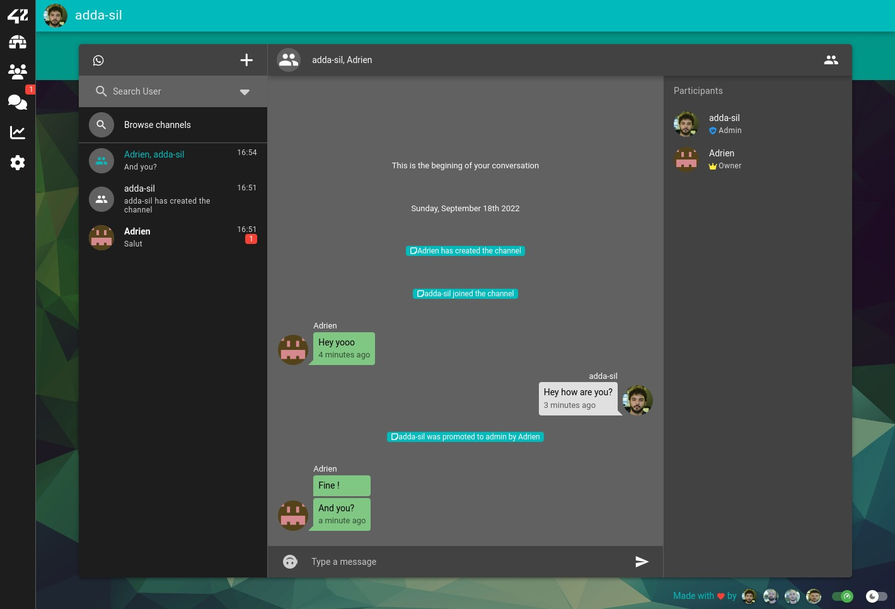

# polypong
---

## Usage

Fill the .env file from .env.example
```
  make prod
```
---

## Description
Last project of 42 Cursus

Battleroyal pong game, with social features (chat, profile, friendship)

To control your paddle, use mouse on desktop and gyroscope on mobile

## Built with:
  - Back: NestJS, TypeOrm, Swagger, Passport (Oauth 42+Google)
  - Data: PostgresSQL, Redis,
  - Front: VueJS 3.0 (With composition API only), Quasar, PiniaJS, Mande, VueUse, AnimeJS
  - Other: Docker, Docker Compose, Nginx as reverse proxy, Mailhog, Geometric.js, Collider2d, Flat Surface Shaders, Socket.io

## Powers:
- add-ball (blue) - Add a new ball in the game
- reduce-enemies (red) - Reduce the size of all paddles other than those in your coalition
- upsize-allies (green) - Increase the size of all paddles in your coalition
- see-trajectories (yellow) - Players in your coalition where a wall will hit next
- sadi-slap (pink) - Nicolas Sadirac will slap the ball, change randomly the trajectory

## Todo
- [ ] Coalition mode (you can't slay paddles from your coalition)
- [ ] Coalition ladder
- [ ] Rework engine for netcode optimizations

---
## Demo



https://github.com/Untel/polypong/assets/15136981/22731f79-4d13-400e-a8d6-14a776b8788d
